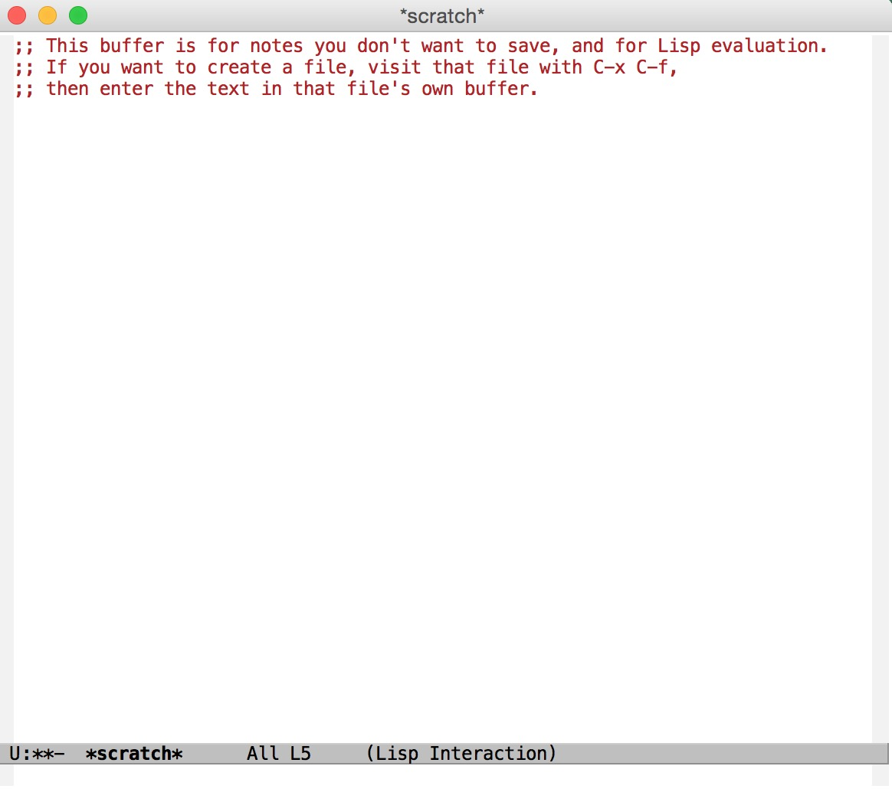

<h2>Table of Contents</h2>

<ul>
<li><a href="#sec-1">1. 从头开始配置Emacs</a>
<ul>
<li><a href="#sec-1-1">1.1. 创建配置目录</a></li>
<li><a href="#sec-1-2">1.2. 从Better-Default开始配置</a></li>
<li><a href="#sec-1-3">1.3. init.el 版本检查</a></li>
<li><a href="#sec-1-4">1.4. init.el 引入配置文件夹</a></li>
</ul>
</li>
</ul>

# 从头开始配置Emacs

## 创建配置目录

在Emacs安装完成后，在用户根目录下 **~/** 是没有emacs相关的配置文件的，因此这里我们从头开始创建一个新的配置，并一点一点按我们的需求，进行增加配置，以达到我们的配置要求；
-   创建 **~/.emacs.d** 目录，并在目录下创建一个 **init.el** 文件，init.el将是emacs启动时，默认读取的第一个文件；
-   创建 **~/.emacs.d/lisp/** 目录，此目录用于存放我们新增加的配置文件；

## 从Better-Default开始配置

虽然配置从零开始，但网上已经有帮我们整理好的一个better default版本的初始配置文件，因此我们可以先利用它来进行初使化配置，下载地址：<https://github.com/technomancy/better-defaults>
将下载下来的 **better-default.el** 文件，放入 **~/.emacs.d/lisp/** 目录中；

## init.el 版本检查

**init.el** 文件是在emacs启动时首先加载的文件，因此在文件开始的位置，我们需要对emacs的版本做一个判断，以排除低版本可能导致的配置的问题；在空文件 **init.el** 内加入以下代码：

    (let ((minver "23.3"))
      (when (version<= emacs-version "23.1")
        (error "Your Emacs is too old -- this config requires v%s or higher" minver)))
    (when (version<= emacs-version "24")
      (message "Your Emacs is old, and some functionality in this config will be disabled. Please upgrade if possible."))

可以看到，本配置文件，只支持23.1版本以上的Emacs, 并且对24版本以下的用户做了相应的升级提示；

## init.el 引入配置文件夹

因最后可能配置的文件比较多，因此我们前面创建了一个 **~/.emacs.d/lisp/** 文件夹，用来存储我们的配置文件的，因此需要将此目录加载到emacs启动目录中；

    (add-to-list 'load-path (expand-file-name "lisp" user-emacs-directory))

然后将我们前面下载的 **better-default.el** 以包的方式引入进我们的工程中；

    (require 'better-default)

这时，启动emacs，则可以看到启动正常；

